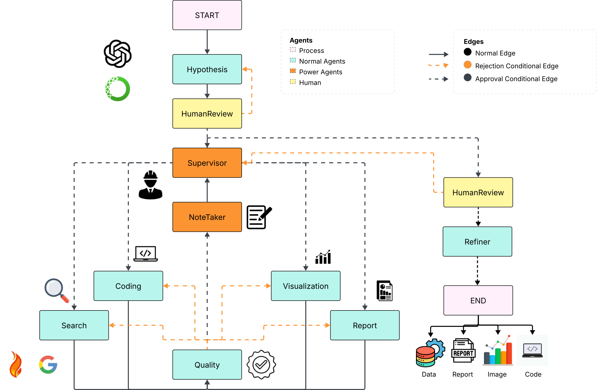

# AI Multi-Agent Research System 


 <a href="https://www.linkedin.com/in/christianmijangos5454"></a>

A sophisticated multi-agent AI system designed to assist with research tasks using LangChain and various specialized tools. This system employs multiple AI agents working in concert to handle different aspects of the research process.


## Overview

This system is built on a multi-agent architecture where each agent specializes in a specific aspect of the research process. The workflow is managed through LangChain's StateGraph, allowing for flexible and dynamic research processes.


## Agents

### Core Agents

1. **Hypothesis Agent**
   - Entry point for research tasks
   - Formulates and refines research hypotheses
   - Guides the initial direction of research

2. **Process Agent**
   - Orchestrates the research workflow
   - Delegates tasks to specialized agents
   - Makes decisions about next steps in the research process

3. **Search Agent**
   - Performs web searches and information gathering
   - Utilizes web scraping capabilities
   - Collects relevant research materials

4. **Code Agent**
   - Handles code-related tasks
   - Implements technical solutions
   - Manages code execution and testing

5. **Visualization Agent**
   - Creates visual representations of data
   - Generates charts, graphs, and other visualizations
   - Helps in data interpretation

6. **Report Agent**
   - Compiles research findings
   - Generates comprehensive reports
   - Synthesizes information from other agents

### Support Agents

7. **Quality Review Agent**
   - Ensures quality control
   - Reviews outputs from other agents
   - Maintains research standards

8. **Note Agent**
   - Maintains research documentation
   - Records important findings
   - Manages knowledge base

9. **Refiner Agent**
   - Improves and iterates on results
   - Refines research outputs
   - Enhances quality of deliverables

## Tools and Capabilities

### Web Interaction Tools
- Advanced web scraping using multiple methods:
  - WebBaseLoader for basic scraping
  - FireCrawlLoader for enhanced scraping
  - Fallback mechanisms for reliable data collection
- Search functionality with rate limiting (5 searches per session)
- CAPTCHA handling capabilities

## Workflow

The system follows a flexible workflow that can be customized based on research needs:

1. Initial hypothesis formation
2. Human review and direction
3. Iterative process through various agents
4. Quality review checkpoints
5. Refinement and improvement cycles
6. Final human review

The workflow can be modified in the `core/workflow.py` file to adapt to different research requirements.

## Known Limitations and Areas for Improvement

1. **Refiner Agent Enhancement Needed**
   - Current implementation could be improved
   - Needs better refinement strategies

2. **Code Execution Issues**
   - Some limitations in code execution capabilities
   - May need additional error handling

3. **Search Limitations**
   - Google Search currently limited to 5 searches per session due to CAPTCHA
   - Consider implementing alternative search methods
   - Potential to adjust max searches in code

## Setup and Usage

Create a `.env` file in the root directory with the following configuration:

```env
# Working Directory
WORKING_DIRECTORY=data

# Anaconda Configuration (required)
CONDA_PATH=USER\miniconda3
CONDA_ENV=conda

# ChromeDriver Configuration (required)
CHROMEDRIVER_PATH=chromedriver-win32\chromedriver-win32\chromedriver.exe

# API Keys
# FireCrawl API Key (optional)
FIRECRAWL_API_KEY=fc-xxxxxxxxxxxxxxxxxxxxxxxxxxxxxxxx

# OpenAI API Key (required)
# Warning: This key is essential; the program will not run without it
OPENAI_API_KEY=sk-proj-xxxxxxxxxxxxxxxxxxxxxxxxxxxxxxxxxxxxxxxxxxxxxxxxxx

# LangChain API Key (optional)
# Used for monitoring the processing
LANGCHAIN_API_KEY=lsv2_pt_xxxxxxxxxxxxxxxxxxxxxxxxxxxxxxxxxxxxxxxxxxxxxxxxx
```

### Installation Steps

1. Clone the repository:
```bash
git clone https://github.com/HeyChriss/AI-Agent-Research.git
cd AI-Agent-Research
```

2. Set up Conda environment:
```bash
conda create -n your_env_name python=3.10
conda activate your_env_name
```

3. Install dependencies:
```bash
pip install -r requirements.txt
```

4. Configure your environment:
   - Copy the `.env.example` file to `.env`
   - Fill in your API keys and paths in the `.env` file
   - Make sure ChromeDriver is installed and the path is correctly set

5. Run the application:
```bash
python main.py
```
## Notes
Ensure you have sufficient OpenAI API credits, as the system will make multiple API calls.
The system may take some time to complete the entire research process, depending on the complexity of the task.
WARNING: The agent system may modify the data being analyzed. It is highly recommended to backup your data before using this system.

## Dependencies

- LangChain
- Selenium
- BeautifulSoup4
- Other required packages [To be listed based on your requirements file]

## Contributing

Contributions are welcome! Please feel free to submit pull requests, particularly for known limitation areas.

## Video Demostration

Link of the presentation https://cdnapisec.kaltura.com/index.php/extwidget/preview/partner_id/1157612/uiconf_id/42438192/entry_id/1_k25h8fcq/embed/dynamic

## License

MIT License

Copyright (c) 2025 Christian

Permission is hereby granted, free of charge, to any person obtaining a copy
of this software and associated documentation files (the "Software"), to deal
in the Software without restriction, including without limitation the rights
to use, copy, modify, merge, publish, distribute, sublicense, and/or sell
copies of the Software, and to permit persons to whom the Software is
furnished to do so, subject to the following conditions:

The above copyright notice and this permission notice shall be included in all
copies or substantial portions of the Software.

THE SOFTWARE IS PROVIDED "AS IS", WITHOUT WARRANTY OF ANY KIND, EXPRESS OR
IMPLIED, INCLUDING BUT NOT LIMITED TO THE WARRANTIES OF MERCHANTABILITY,
FITNESS FOR A PARTICULAR PURPOSE AND NONINFRINGEMENT. IN NO EVENT SHALL THE
AUTHORS OR COPYRIGHT HOLDERS BE LIABLE FOR ANY CLAIM, DAMAGES OR OTHER
LIABILITY, WHETHER IN AN ACTION OF CONTRACT, TORT OR OTHERWISE, ARISING FROM,
OUT OF OR IN CONNECTION WITH THE SOFTWARE OR THE USE OR OTHER DEALINGS IN THE
SOFTWARE.
